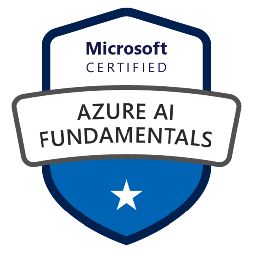

# AI-900 Fundamentals

 

 
Este repositorio contiene notas y resumenes propios de cada uno de los modulos, así como otros recursos útiles para prepararse para el examen AI-900: Microsoft Azure AI Fundamentals.

 

### 🔍 HABILIDADES CLAVE

* Describir las cargas de trabajo y las consideraciones de inteligencia artificial (15-20 %)
* Describir los principios fundamentales del aprendizaje automático en Azure (20-25 %)
* Describir las características de las cargas de trabajo de visión por ordenador en Azure (15-20 %)
* Describir las características de las cargas de trabajo de procesamiento del lenguaje natural (NLP) en Azure (15-20 %)
* Describir las características de las cargas de trabajo de IA generativas en Azure (15–20 %)

 

### 📚 CONTENIDO

1. Introducción a AI
2. Machine Learning
3. Computer Vision
4. Procesamiento de lenguaje natural (NLP)
5. Minería de conocimiento e inteligencia de documentos
6. Inteligencia artificial generativa

 

### 🔗 RECURSOS 

- [Curso AI-900 Microsoft Azure AI Fundamentals](https://docs.microsoft.com/en-us/learn/paths/ai-fundamentals/)
- [Preguntas de práctica AI-900](https://learn.microsoft.com/es-es/credentials/certifications/azure-ai-fundamentals/?practice-assessment-type=certification#certification-practice-for-the-exam)
- [Laboratorios prácticos AI-900](https://learn.microsoft.com/es-es/credentials/certifications/azure-ai-fundamentals/?practice-assessment-type=certification#certification-practice-for-the-exam)
- [Suscripción de Azure gratis durante 30 días](https://aka.ms/Azure-gratis)
- [Suscripción de Azure para estudiantes](https://azure.microsoft.com/free/students/)

 EXTRA: Video de preparación para el examen AI-900: [Youtube](https://www.youtube.com/watch?v=hHjmr_YOqnU)

 